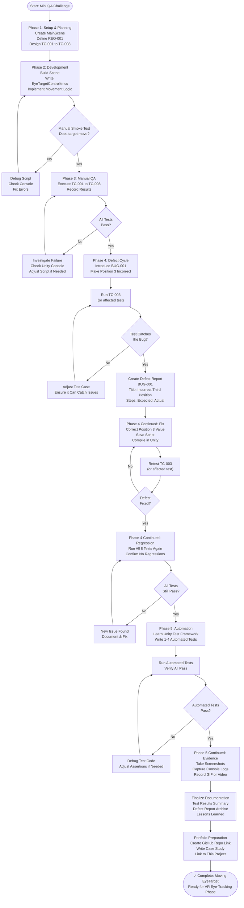

# Moving EyeTarget Mini QA Challenge
## Project Plan, Flowchart & Checklist

---

## Part 1: Project Plan Draft

### Project Title
**Moving EyeTarget: Mini QA Challenge for VR Eye-Tracking Foundation**

### Project Overview
This mini-project establishes foundational QA skills in a controlled Unity environment. The deliverable is a small 3D scene featuring a moving cube (`EyeTarget`) that cycles through three predefined positions. The project emphasizes the full QA lifecycle: requirement analysis, manual testing, deliberate defect introduction, defect detection, fix, and regression testing.

### Project Goals
- [ ] Create a working Unity scene with a moving target object
- [ ] Practice writing requirements and test cases before coding
- [ ] Execute manual QA test cases
- [ ] Introduce a controlled defect and verify test detection
- [ ] Fix the defect and conduct regression testing
- [ ] Document the entire QA cycle with evidence
- [ ] Build the foundation for automated test frameworks (Unity Test Framework)
- [ ] Gather portfolio-ready QA artifacts

### Project Scope

**In Scope:**
- Unity 3D scene setup (`MainScene`)
- Single C# script (`EyeTargetController`)
- Movement logic for 3 positions
- 8 manual test cases
- 1 deliberate defect cycle
- Manual test execution and documentation
- Basic Unity Test Framework integration (1-4 automated tests)
- Screenshots and evidence collection

**Out of Scope:**
- Advanced graphics or animation
- Networked multiplayer features
- Performance optimization
- Third-party asset integration (beyond standard Unity)
- Eye-tracking sensor integration (reserved for later phases)

### Project Constraints

| Constraint | Details |
|---|---|
| **Timeline** | 1-2 weeks part-time (integrated into 12-week VR learning plan) |
| **Tools** | Unity Hub, VS Code, Git |
| **Platforms** | Development machine (Windows/Mac/Linux) |
| **Dependencies** | Unity 2022 LTS or later, C# 8.0+ |
| **Team** | Solo (self-study) |
| **Evidence** | Screenshots, test reports, defect logs, console logs |

### Key Deliverables

| Deliverable | Format | Owner | Status |
|---|---|---|---|
| MainScene Unity file | `.unity` | Rita | Not Started |
| EyeTargetController.cs script | `.cs` | Rita | Not Started |
| Test Design Document | Markdown | Rita | Not Started |
| Manual Test Execution Log | Markdown / CSV | Rita | Not Started |
| Defect Report (BUG-001) | Markdown | Rita | Not Started |
| Regression Test Report | Markdown | Rita | Not Started |
| Automated Tests (Unity Test Framework) | `.cs` | Rita | Not Started |
| Project Portfolio Evidence | Screenshots, GIFs, links | Rita | Not Started |

### Success Criteria

The project is **PASS** when:

1. **Functionality** - EyeTarget moves predictably through Positions 1 → 2 → 3 → 1 (cyclically)
2. **Testing** - All 8 test cases pass in the "correct" version
3. **Defect Capture** - TC-003 (or another test case) detects BUG-001 (incorrect Position 3)
4. **Defect Management** - Defect is documented, fixed, and retested successfully
5. **Regression** - All 8 test cases pass after the fix (no regression)
6. **Automation** - At least 1 automated test written and passing with Unity Test Framework
7. **Evidence** - All test results, defect reports, and screenshots are archived
8. **Documentation** - Project is ready for portfolio inclusion with clear narrative

### Project Phases

#### Phase 1: Setup & Planning (Days 1-2)
- Create or open VR-Eye-Tracking-Lab project in Unity
- Create MainScene
- Design the requirement (REQ-001)
- Design 8 test cases (TC-001 through TC-008)

#### Phase 2: Development (Days 3-4)
- Scene setup (Main Camera, Light, Cube → EyeTarget)
- Create EyeTargetController.cs script
- Implement movement logic
- Verify manual functionality

#### Phase 3: Manual QA (Days 5-6)
- Execute all 8 test cases
- Document results
- Identify any unplanned issues

#### Phase 4: Defect Cycle (Days 7-8)
- Introduce BUG-001 (incorrect Position 3)
- Re-run relevant test case
- Confirm defect is caught
- Create defect report
- Fix the defect
- Retest TC-003
- Run full regression (all 8 tests)

#### Phase 5: Automation & Evidence (Days 9-10)
- Learn Unity Test Framework basics
- Write 1-4 automated tests
- Verify tests pass with corrected code
- Collect screenshots and documentation
- Archive evidence for portfolio

### Resource Plan

| Role | Resource | Allocation | Notes |
|---|---|---|---|
| Developer | Rita | 100% | Script writing, debugging |
| QA Tester | Rita | 100% | Test case design, execution |
| Documentation | Rita | 50% | Test logs, defect reports, screenshots |

### Risk Register

| Risk | Impact | Likelihood | Mitigation |
|---|---|---|---|
| Unity script compilation errors | High | Medium | Reference official Unity docs; use VS Code + Intellisense |
| Difficulty creating/debugging movement logic | High | Low | Break logic into smaller functions; add debug logs |
| Test cases too complex | Medium | Low | Keep test cases minimal; one action per step |
| Time overrun | Medium | Medium | Set daily time limits (2-3 hours); prioritize manual QA over automation |
| Portfolio evidence loss | High | Low | Commit to Git; save screenshots immediately; use cloud backup |

---

## Part 2: Project Flowchart (Mermaid)

---

## Part 3: Complete Checklist

### Pre-Project Checklist

#### Environment Setup
- [ ] Unity Hub is installed
- [ ] Unity 2022 LTS (or later) is installed
- [ ] VS Code is installed and configured for C# development
- [ ] Git is installed and configured (name, email)
- [ ] VR-Eye-Tracking-Lab project exists and opens without errors
- [ ] Assets/Scenes folder exists in the project

#### Planning & Documentation
- [ ] Read through this entire project plan
- [ ] Review the Learning Objectives
- [ ] Confirm understanding of Unity Hierarchy, Inspector, and Scene Viewer
- [ ] Reserve 1-2 weeks in calendar for this project
- [ ] Create a GitHub branch or local git branch for this work

---

### Phase 1: Setup & Planning Checklist

#### Create or Open Project
- [ ] Open Unity Hub
- [ ] Open or create project: `VR-Eye-Tracking-Lab`
- [ ] Confirm the project opens without errors
- [ ] Open the Console (Window > General > Console) to check for initial errors
- [ ] Create folder `Assets/Scenes` if it does not exist

#### Create MainScene
- [ ] Right-click `Assets/Scenes`
- [ ] Create > Scene
- [ ] Name the scene `MainScene`
- [ ] Double-click `MainScene` to open it
- [ ] Confirm the Hierarchy shows the default scene objects
- [ ] Save the scene (Ctrl+S or Cmd+S)

#### Define Requirement
- [ ] Write REQ-001: "When the user activates the movement command, EyeTarget shall move from its current position to the next predefined target position."
- [ ] Define Position 1 coordinates (e.g., (0, 0, 0))
- [ ] Define Position 2 coordinates (e.g., (5, 0, 0))
- [ ] Define Position 3 coordinates (e.g., (5, 0, 5))
- [ ] Define how movement is triggered (e.g., Space key, Update loop with timer)
- [ ] Define behavior after Position 3 (cycle back to Position 1)
- [ ] Document these decisions in a text file or notebook

#### Design Test Cases (8 total)
- [ ] **TC-001: Initial Target Visibility** - Verify EyeTarget is visible at Position 1
- [ ] **TC-002: Move to Position 2** - Verify movement to Position 2 works
- [ ] **TC-003: Move to Position 3** - Verify movement to Position 3 works
- [ ] **TC-004: Return to Position 1** - Verify cycle back to Position 1 works
- [ ] **TC-005: Repeated Movement** - Verify repeated cycles work without glitches
- [ ] **TC-006: Restart Behavior** - Verify target resets to Position 1 on scene reload
- [ ] **TC-007: Target Visibility During Movement** - Verify target remains visible at all positions
- [ ] **TC-008: Console Check** - Verify no unexpected runtime errors in Console
- [ ] Document each test case with: Test Case ID, Steps, Expected Result, Actual Result (column for later filling)

#### Prepare Test Tracking Document
- [ ] Create a markdown or CSV file: `Test-Execution-Log.md`
- [ ] Add headers: Test Case ID, Steps, Expected, Actual, Pass/Fail, Notes, Date/Time
- [ ] Leave rows empty for Phase 3 execution

---

### Phase 2: Development Checklist

#### Scene Setup
- [ ] Confirm `Main Camera` exists in Hierarchy
- [ ] Confirm `Directional Light` exists in Hierarchy (or create one if missing)
- [ ] Right-click Hierarchy > 3D Object > Cube
- [ ] Rename the cube to `EyeTarget`
- [ ] Select `EyeTarget` and verify it appears in Game view
- [ ] Position `EyeTarget` in the center (e.g., (0, 0, 0)) for easy visibility
- [ ] Save the scene

#### Create EyeTargetController Script
- [ ] Right-click `Assets` > Create > C# Script
- [ ] Name the script `EyeTargetController`
- [ ] Open the script in VS Code
- [ ] Write the following basic structure:
  - [ ] `using UnityEngine;` namespace
  - [ ] `public class EyeTargetController : MonoBehaviour`
  - [ ] Private array or list for three positions: `Vector3[] positions`
  - [ ] Private int for current position index: `int currentIndex = 0`
  - [ ] `void Start()` to initialize positions
  - [ ] `void Update()` to listen for input (Space key)
  - [ ] `void MoveToNextPosition()` method to update position and increment index
  - [ ] Cycle index back to 0 after Position 3

#### Implement Movement Logic
- [ ] Position 1 = (0, 0, 0) or your chosen starting position
- [ ] Position 2 = (5, 0, 0) or your chosen second position
- [ ] Position 3 = (5, 0, 5) or your chosen third position
- [ ] In `Update()`, check for Space key press: `if (Input.GetKeyDown(KeyCode.Space))`
- [ ] Call `MoveToNextPosition()` on key press
- [ ] In `MoveToNextPosition()`, update the cube's position: `transform.position = positions[currentIndex]`
- [ ] Increment index: `currentIndex++`
- [ ] Cycle back: `if (currentIndex >= positions.Length) currentIndex = 0`
- [ ] Add debug output: `Debug.Log($"Moved to Position {currentIndex + 1}: {positions[currentIndex]}")`
- [ ] Save the script (Ctrl+S)

#### Attach Script to EyeTarget
- [ ] Return to Unity
- [ ] Wait for script compilation
- [ ] Select `EyeTarget` in Hierarchy
- [ ] Drag `EyeTargetController` script into the Inspector's Add Component area (or use Add Component button)
- [ ] Confirm the script is now attached to `EyeTarget`
- [ ] Verify no compilation errors in the Console
- [ ] Save the scene

#### Manual Smoke Test
- [ ] Press Play (or Ctrl+P)
- [ ] Observe the Game view
- [ ] Verify `EyeTarget` cube is visible
- [ ] Press Space key
- [ ] Observe if the cube moves to Position 2
- [ ] Press Space key again
- [ ] Observe if the cube moves to Position 3
- [ ] Press Space key again
- [ ] Observe if the cube returns to Position 1
- [ ] Check the Console for any errors
- [ ] Press Stop to exit Play mode
- [ ] If no movement occurs or errors appear, go back and debug the script
- [ ] If smoke test passes, proceed to Phase 3

---

### Phase 3: Manual QA Execution Checklist

#### Pre-Test Setup
- [ ] Exit Play mode if in it
- [ ] Open `Test-Execution-Log.md` for recording
- [ ] Have a screenshot tool ready (Print Screen, Snip & Sketch, or Unity's built-in screenshot)
- [ ] Note the current date and time
- [ ] Confirm the scene is saved

#### Execute Test Cases

**TC-001: Initial Target Visibility**
- [ ] Press Play
- [ ] Visually confirm `EyeTarget` cube is visible in Game view
- [ ] Check the cube's position in the Inspector (should be Position 1)
- [ ] Record: Pass or Fail
- [ ] If Pass, take a screenshot
- [ ] Press Stop

**TC-002: Move to Position 2**
- [ ] Press Play
- [ ] Press Space key once
- [ ] Observe the cube's new position in Game view
- [ ] Verify it matches the expected Position 2 coordinates
- [ ] Check Console for the debug log message
- [ ] Record: Pass or Fail
- [ ] If Pass, take a screenshot
- [ ] Press Stop

**TC-003: Move to Position 3**
- [ ] Press Play
- [ ] Press Space key once (move to Position 2)
- [ ] Press Space key a second time (move to Position 3)
- [ ] Observe the cube's new position
- [ ] Verify it matches the expected Position 3 coordinates
- [ ] Check Console for the debug log message
- [ ] Record: Pass or Fail
- [ ] If Pass, take a screenshot
- [ ] Press Stop

**TC-004: Return to Position 1**
- [ ] Press Play
- [ ] Press Space key three times (Position 2, Position 3, Position 1)
- [ ] Observe the cube's final position
- [ ] Verify it returns to Position 1
- [ ] Check Console for debug messages
- [ ] Record: Pass or Fail
- [ ] If Pass, take a screenshot
- [ ] Press Stop

**TC-005: Repeated Movement**
- [ ] Press Play
- [ ] Press Space key 9 times (3 full cycles)
- [ ] Observe the movement pattern at each step
- [ ] Watch for any jittering, delays, or unexpected behavior
- [ ] Check Console for errors
- [ ] Record: Pass or Fail
- [ ] Press Stop

**TC-006: Restart Behavior**
- [ ] Press Play
- [ ] Press Space key 5 times to move through positions
- [ ] Press Stop
- [ ] Press Play again (scene reloads)
- [ ] Verify `EyeTarget` is back at Position 1
- [ ] Record: Pass or Fail
- [ ] If Pass, take a screenshot
- [ ] Press Stop

**TC-007: Target Visibility During Movement**
- [ ] Press Play
- [ ] Press Space key to move through all 3 positions and back
- [ ] At each step, verify the cube remains visible (not off-screen, not hidden)
- [ ] Check that the cube is still solid and not disappearing
- [ ] Record: Pass or Fail
- [ ] Press Stop

**TC-008: Console Check**
- [ ] Press Play
- [ ] Open Console (Window > General > Console)
- [ ] Press Space key multiple times
- [ ] Review Console for any error messages (red text)
- [ ] Ignore info logs (blue) and warnings (yellow)
- [ ] Record: Pass or Fail (Fail only if red errors appear)
- [ ] Press Stop

#### QA Summary
- [ ] Count passing tests: ____ / 8
- [ ] If all 8 pass, proceed to Phase 4
- [ ] If any fail, document the failure and debug the script before proceeding

---

### Phase 4: Defect Cycle Checklist

#### Introduce Deliberate Defect (BUG-001)

**Defect Details:**
- [ ] Defect Name: Incorrect Third Position
- [ ] Scope: The Position 3 coordinate is intentionally wrong
- [ ] Method: Edit `EyeTargetController.cs` and change Position 3 to an incorrect value (e.g., (10, 0, 10) instead of (5, 0, 5))

**Steps to Introduce:**
- [ ] Open `EyeTargetController.cs` in VS Code
- [ ] Locate the line where Position 3 is defined (e.g., `positions[2] = new Vector3(5, 0, 5);`)
- [ ] Change the coordinates to something obviously wrong (e.g., `new Vector3(10, 0, 10);`)
- [ ] Save the script
- [ ] Return to Unity and confirm it compiles

#### Run Test to Catch Defect
- [ ] Press Play
- [ ] Execute TC-003 (Move to Position 3)
  - [ ] Press Space once (to Position 2)
  - [ ] Press Space again (to Position 3)
- [ ] Observe: Does the cube appear at the wrong location?
- [ ] Record: **Fail** (intentional)
- [ ] Take a screenshot showing the incorrect position
- [ ] Press Stop
- [ ] Confirm that TC-003 **fails** and detects the defect

#### Document Defect Report (BUG-001)

Create a markdown file: `Defect-Report-BUG-001.md`

- [ ] **Defect ID:** BUG-001
- [ ] **Title:** EyeTarget moves to an incorrect third position
- [ ] **Severity:** Low (does not crash the app, just wrong position)
- [ ] **Status:** Open
- [ ] **Environment:** Unity / Development Machine
- [ ] **Test Case Linked:** TC-003
- [ ] **Steps to Reproduce:**
  - [ ] Start MainScene
  - [ ] Press Play
  - [ ] Press Space once
  - [ ] Press Space a second time
  - [ ] Observe the target position
- [ ] **Expected Result:** EyeTarget appears at Position 3 (5, 0, 5)
- [ ] **Actual Result:** EyeTarget appears at an incorrect location (10, 0, 10) or similar
- [ ] **Screenshot:** Attach image showing the wrong position
- [ ] **Root Cause:** Position 3 value is hardcoded incorrectly in the script

#### Fix the Defect

- [ ] Open `EyeTargetController.cs`
- [ ] Correct Position 3 back to the intended value (e.g., (5, 0, 5))
- [ ] Save the script
- [ ] Wait for Unity to recompile
- [ ] Confirm no compilation errors

#### Retest TC-003 (Defect Verification)
- [ ] Press Play
- [ ] Press Space once (to Position 2)
- [ ] Press Space again (to Position 3)
- [ ] Verify the cube is now at the correct Position 3
- [ ] Check Console for debug messages
- [ ] Record: **Pass** (defect is fixed)
- [ ] Take a screenshot showing the correct position
- [ ] Press Stop

#### Update Defect Report
- [ ] Open `Defect-Report-BUG-001.md`
- [ ] Change **Status** from "Open" to "Fixed"
- [ ] Add a note: "Fixed on [date]. Position 3 value corrected to (5, 0, 5)."
- [ ] Add screenshot showing the corrected behavior

#### Run Full Regression Test Suite

Re-execute all 8 test cases to confirm no regressions:

- [ ] **TC-001:** Initial Target Visibility → **Pass** or **Fail**
- [ ] **TC-002:** Move to Position 2 → **Pass** or **Fail**
- [ ] **TC-003:** Move to Position 3 → **Pass** or **Fail** (should now Pass)
- [ ] **TC-004:** Return to Position 1 → **Pass** or **Fail**
- [ ] **TC-005:** Repeated Movement → **Pass** or **Fail**
- [ ] **TC-006:** Restart Behavior → **Pass** or **Fail**
- [ ] **TC-007:** Target Visibility During Movement → **Pass** or **Fail**
- [ ] **TC-008:** Console Check → **Pass** or **Fail**

#### Regression Summary
- [ ] All 8 tests pass: **Yes** or **No**
- [ ] If all pass, update `Defect-Report-BUG-001.md` status to "Closed" or "Verified Fixed"
- [ ] If any fail unexpectedly, log and investigate before proceeding

---

### Phase 5: Automation & Evidence Checklist

#### Learn Unity Test Framework
- [ ] Read official Unity Test Framework documentation (online)
- [ ] Understand the structure of test classes and test methods
- [ ] Understand assertions (Assert.AreEqual, Assert.IsTrue, etc.)
- [ ] Understand test lifecycle (Setup, Test, Teardown)

#### Create Test Assembly
- [ ] In Assets, create a folder: `Assets/Tests`
- [ ] In `Assets/Tests`, create a subfolder: `EditMode` (for simple tests not needing the scene running)
- [ ] Right-click `Assets/Tests/EditMode`
- [ ] Create > Folder > Name it `Moving EyeTarget Tests`

#### Write Automated Tests
Create a new C# script: `Assets/Tests/EditMode/Moving EyeTarget Tests/MovingEyeTargetTests.cs`

**Test 1: Initial Position**
- [ ] Test name: `TestInitialPositionIsPositionOne`
- [ ] Create a temporary `EyeTarget` GameObject
- [ ] Attach `EyeTargetController` script
- [ ] Assert that `transform.position == new Vector3(0, 0, 0)` (or your Position 1)
- [ ] Clean up after test

**Test 2: Move to Position 2**
- [ ] Test name: `TestMoveToPositionTwo`
- [ ] Create a temporary `EyeTarget` GameObject
- [ ] Attach `EyeTargetController` script
- [ ] Simulate Space key input or call movement method directly
- [ ] Assert that position updates to Position 2
- [ ] Clean up after test

**Test 3: Move to Position 3**
- [ ] Test name: `TestMoveToPositionThree`
- [ ] Similar structure to Test 2
- [ ] Press movement twice to reach Position 3
- [ ] Assert position matches Position 3 coordinates
- [ ] Clean up after test

**Test 4: Cycle Back to Position 1**
- [ ] Test name: `TestCycleBackToPositionOne`
- [ ] Simulate three movements (to Position 2, Position 3, back to Position 1)
- [ ] Assert final position is Position 1
- [ ] Clean up after test

#### Run Automated Tests
- [ ] Open Window > General > Test Runner
- [ ] Click "Run All" or run individual tests
- [ ] Confirm all tests **Pass**
- [ ] Take a screenshot of the Test Runner showing all passes
- [ ] If any tests fail, debug and adjust

#### Verify Tests Catch Defects (Optional but Recommended)
- [ ] Reintroduce BUG-001 (incorrect Position 3)
- [ ] Run automated tests
- [ ] Confirm at least one test **Fails** (Test 3 or Test 4 should fail)
- [ ] Take a screenshot showing the failure
- [ ] Fix the defect
- [ ] Re-run tests
- [ ] Confirm all tests **Pass** again

#### Evidence Collection

**Screenshots:**
- [ ] Screenshot 1: Hierarchy with EyeTarget and script attached
- [ ] Screenshot 2: Inspector showing EyeTargetController component
- [ ] Screenshot 3: MainScene with cube at Position 1
- [ ] Screenshot 4: MainScene with cube at Position 2
- [ ] Screenshot 5: MainScene with cube at Position 3
- [ ] Screenshot 6: Console showing debug log messages
- [ ] Screenshot 7: Test Runner showing all 4 automated tests passing
- [ ] Screenshot 8: VS Code showing the EyeTargetController.cs script

**Documentation:**
- [ ] `Test-Execution-Log.md` - All manual test results
- [ ] `Defect-Report-BUG-001.md` - Complete defect lifecycle
- [ ] `MovingEyeTargetTests.cs` - Automated test code
- [ ] `README.md` - Project summary and how to run

#### Portfolio Preparation
- [ ] Create a GitHub repository: `moving-eyetarget-qa-challenge`
- [ ] Clone the repository locally
- [ ] Copy the entire Unity project into the repo (or link to it)
- [ ] Copy all markdown documentation files
- [ ] Add a `.gitignore` file (standard Unity .gitignore)
- [ ] Commit all files with a message: "Initial commit: Moving EyeTarget mini QA challenge"
- [ ] Push to GitHub
- [ ] Create a `CASE-STUDY.md` file in the repo describing:
  - [ ] Project objectives
  - [ ] What you learned
  - [ ] Screenshots and evidence
  - [ ] Links to test reports
  - [ ] How this connects to the larger VR eye-tracking project

#### Final Sign-Off Checklist
- [ ] MainScene opens and runs without errors
- [ ] EyeTarget moves through all 3 positions correctly
- [ ] All 8 manual test cases pass
- [ ] BUG-001 was introduced, detected, fixed, and verified
- [ ] Full regression test suite passes (all 8 tests)
- [ ] At least 4 automated tests written and passing
- [ ] All evidence (screenshots, logs, reports) collected and archived
- [ ] GitHub repository is public and contains all project files
- [ ] Portfolio case study is written and linked
- [ ] Project README clearly explains how to clone and run the project
- [ ] All deliverables are complete and ready for review

---

## Definition of Done

✓ The **Moving EyeTarget mini QA challenge** is **COMPLETE** when:

1. The Unity scene runs without errors
2. The cube (`EyeTarget`) moves predictably through Positions 1 → 2 → 3 → 1
3. All 8 manual test cases pass
4. A deliberate defect (BUG-001) is introduced and successfully detected by testing
5. The defect is fixed and retested
6. Full regression testing passes (no new issues introduced)
7. At least 4 automated tests are written and passing (Unity Test Framework)
8. All evidence is documented and archived (screenshots, logs, defect reports)
9. A public GitHub repository exists with complete project files and case study
10. The project is ready to transition to the **VR eye-tracking phase** and serves as foundation for future automation

---

## Next Steps (After Completion)

- [ ] Review the completed project and case study
- [ ] Schedule a reflection session to document lessons learned
- [ ] Begin Phase 2 of the VR automation learning plan: Eye-tracking integration
- [ ] Link this project to your personal portfolio website
- [ ] Consider pairing with more complex automation frameworks (e.g., Selenium, Appium) for comparison

---

**Project Owner:** Rita  
**Project Start Date:** [Date]  
**Project Completion Date:** [Date]  
**Total Hours Invested:** [Hours]  
**Status:** Not Started → In Progress → Complete

---

*This document is a living plan. Update sections as the project progresses. Good luck! 🎯*
